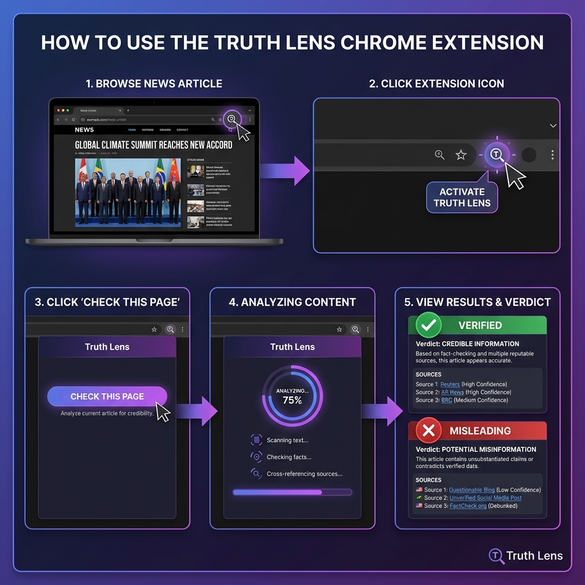

# 🚀 Quick Start Guide - Truth Lens Chrome Extension

## ⚡ 3-Minute Setup

### Step 1: Start Backend (1 minute)

Open terminal and run:
```bash
cd "c:\Users\Hp\OneDrive - Shri Vile Parle Kelavani Mandal\Desktop\Hackathons\Mumbai Hacks\Vihaan\mum-hacks-misinfo"
python run.py
```

✅ Wait for: `Uvicorn running on http://0.0.0.0:8000`

---

### Step 2: Install Extension (1 minute)


1. Open Chrome → `chrome://extensions/`
2. Enable **Developer mode** (top-right toggle)
3. Click **Load unpacked**
4. Select folder: `chrome-extension`
5. Pin extension to toolbar (click 🧩 icon)

---

### Step 3: Use Extension (1 minute)



1. **Open any news article** in Chrome
2. **Click Truth Lens icon** in toolbar
3. **Click "Check This Page"** button
4. **Wait 15-30 seconds** for analysis
5. **Review results:**
   - ✓ Green = Verified
   - ✗ Red = Misinformation

---

## 🎯 That's It!

You're now ready to fact-check news articles with one click!

---

## 🔧 Troubleshooting

### Extension not working?

**Check backend:**
```bash
curl http://localhost:8000/test
```
Should return: `{"status":"ok","message":"API is working!"}`

**Check extension settings:**
1. Right-click extension icon → Options
2. Click "Test Connection"
3. Should show: "✓ Connection successful!"

---

## 📚 Full Documentation

For detailed instructions, see:
- [DEPLOYMENT_GUIDE.md](DEPLOYMENT_GUIDE.md) - Complete step-by-step guide
- [README.md](README.md) - Full documentation

---

## 💡 Quick Tips

✅ **DO:**
- Keep backend running while using extension
- Test on mainstream news sites (BBC, CNN, Reuters)
- Read full analysis, not just verdict
- Check multiple sources

❌ **DON'T:**
- Use on paywalled content
- Expect instant results (takes 15-30s)
- Trust verdict blindly - always verify

---

## 🎓 Example Usage

**Scenario:** You see a viral news article on social media

1. Copy article URL
2. Open in Chrome
3. Click Truth Lens icon
4. Click "Check This Page"
5. Wait for verdict
6. Read reasoning and sources
7. Make informed decision

---

## 📞 Need Help?

See [DEPLOYMENT_GUIDE.md](DEPLOYMENT_GUIDE.md) for:
- Detailed troubleshooting
- Advanced features
- Common issues and solutions

---

**Happy Fact-Checking! 🔍✨**
